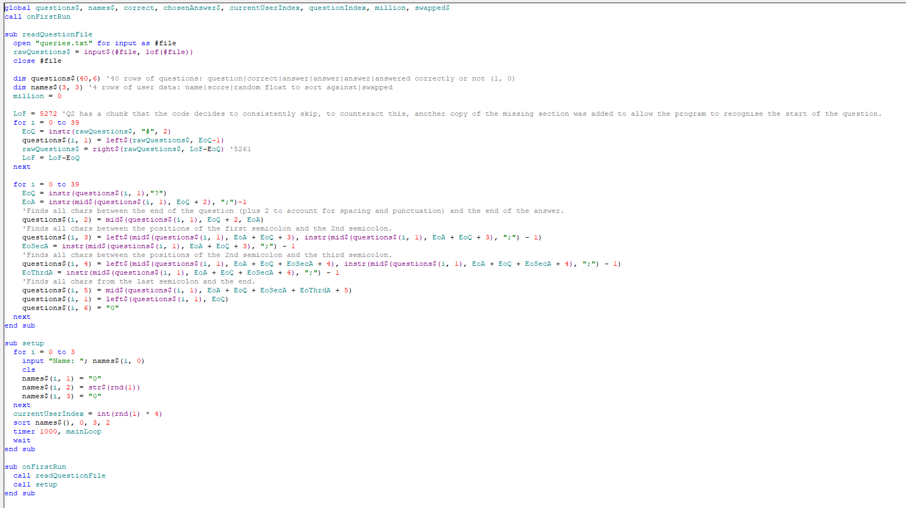
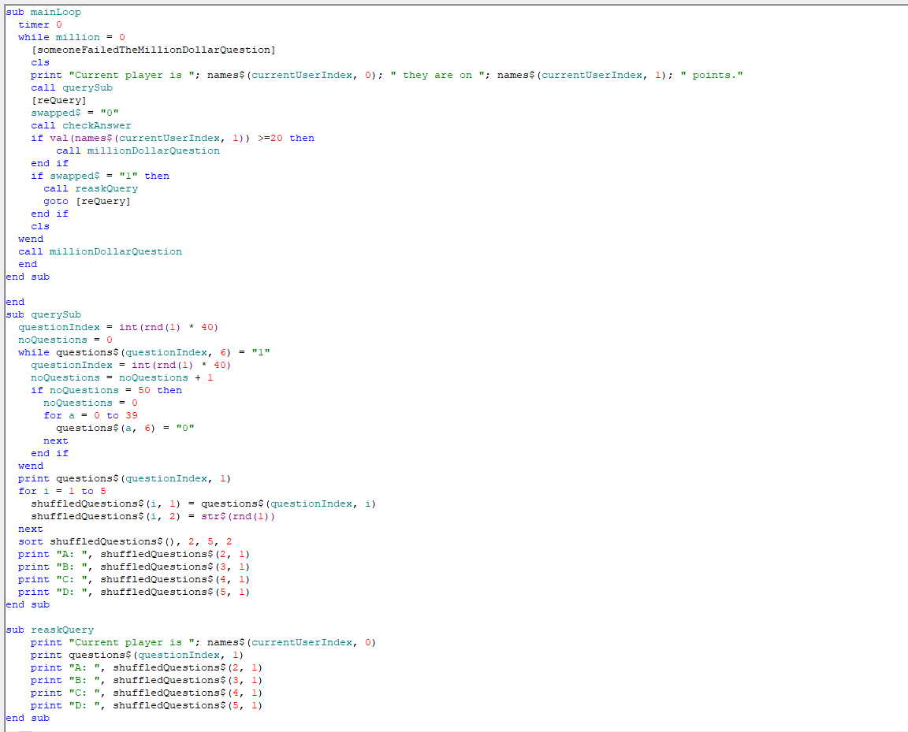
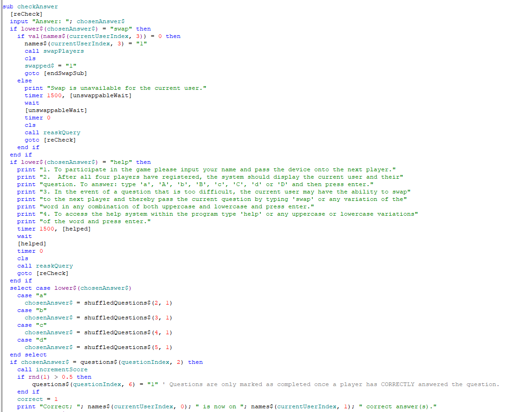
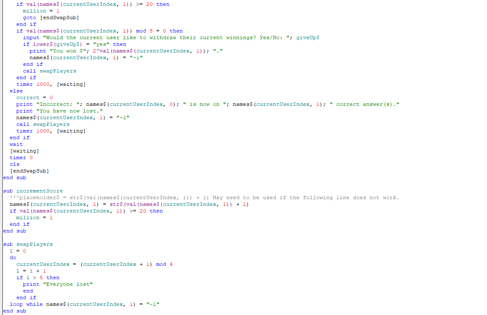
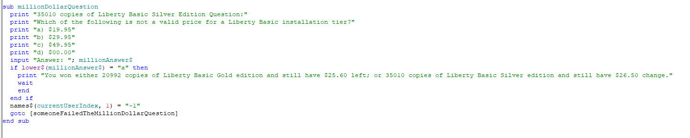

# Million Dollar Hot Seat

   

Million Dollar Hot Seat (Option 4) was the chosen task for the Software Design and Development Individual Programming task.

<a href="https://www.buymeacoffee.com/afa5e"></a> <a href="https://www.patreon.com/afa5e"></a> <a href="https://issuehunt.io/r/afa5e/Million-Dollar-Hot-Seat"></a><a href="https://github.com/afa5e/Million-Dollar-Hot-Seat/blob/master/img/wechat.jpg"></a>

## Contents
1. [License](#License)
1. [Installation instructions](#installation-and-executing)
1. [Usage Instructions](#usage-instructions)
1. [The Problem](#the-problem)
1. [FAQ](#faq)
1. [Answer Key](#answer-key)
1. [Issues](#issues)
1. [Testing](#testing)
1. [Code of Conduct](#code-of-conduct)
1. [Social and Ethical issues](#social-and-ethical-issues)
1. [Logbook](#logbook)
1. [Source code](#source-code)
1. [Sources](#sources)

## License
The following is a summary of the full do what the ~~fuck~~ you want to but with conditions public license. For the full license, please view the license file [here](/LICENSE)
```
DO WHAT THE **** YOU WANT TO BUT WITH CONDITIONS PUBLIC LICENSE
                  Version 2, December 2004

Copyright (C) 2004 Sam Hocevar <sam@hocevar.net>; changes made
by "Afa5e" <www.instagram.com/afa5e/>

Everyone is permitted to copy and distribute verbatim or modified
copies of this license document, and changing it is allowed as long
as the name is changed.
 
           DO WHAT THE **** YOU WANT TO PUBLIC LICENSE
  TERMS AND CONDITIONS FOR COPYING, DISTRIBUTION AND MODIFICATION

 0. You just DO WHAT THE **** YOU WANT TO.
```
[Return to the top.](#million-dollar-hot-seat)

## Installation and Executing
  To run the Million Dollar Hot Seat program:
  1. Download the free version of Liberty Basic from [here](https://www.libertybasic.com/download.html) and install with default settings.
  1. Open the ```main.bas``` file with the Liberty Basic editor and after waiting for the advertisement to close, and either:
  * Move the mouse over to the blue triangle approximately 9 icons from the left on the screen.
  * Select "Run" from the menu bar and then select "Run" from the dropdown menu.
  * Simultaneously press ```shift``` and ```F5```.

[Return to the top.](#million-dollar-hot-seat)

## Usage instructions
  1. To participate in the game please input your name and pass the device onto the next player.
  1. After all four players have registered, the system should display the current user and their question. To answer: type "a", "A", "b", "B", "c", "C", "d" or "D" and then press enter.
  1. In the event of a question that is too difficult, the current user may have the ability to swap to the next player and thereby pass the current question by typing "swap" or any variation of the word in any combination of both uppercase and lowercase and press enter.
  1. To access the help system within the program type "help" or any uppercase or lowercase variations of the word and press enter.

[Return to the top.](#million-dollar-hot-seat)

## The problem
The problem that this piece of magnificent software was designed to solve was an undisclosed customer wanted a system that could emulate a popular game, Million Dollar Hot Seat. This included a bank comprised of a minimum of 40 questions, room for four players, the ability for users to skip or swap out of the hot seat and to potentially win 35010 copies of Liberty Basic Silver Edition, worth 2^20 USD.

[Return to the top.](#million-dollar-hot-seat)

## FAQ
  1. Why do I lose the game after one incorrect answer?

     The game is designed to be a high risk, exponentially increasing at a rate of $2^x × ln(2) where x is the round number reward. This means that to win the 35010 copies of Liberty Basic Silver Edition, the user must get all 21 questions correct.

  2. Why are the questions more hardware orientated?

     Why not? Hardware and software must both function together for a computer system to work at all.

  3. Why does Liberty Basic force me to wait up to an infinite time period upon opening the file?

     Liberty Basic is known to hold the user's valuable time ransom in exchange for the low price of $29.95 or $49.95 to upgrade to a higher tier that hopefully waives the waiting period. Alternatively, simply uninstall and reinstall Liberty Basic on your device.

  4. How or where can I purchase a copy of this software for commercial use?

     This software will be released to the general public for any usage including commercial usage on or after the 14th of August 2020 (14/8/2020) without any licenses for no charge.

  5. Where can I collect my prize?

     The prize has already been collected.

  6. Why is this FAQ not helpful?

     The author of this document did not anticipate any questions regarding this program that is frequently asked.

[Return to the top.](#million-dollar-hot-seat)

## Answer key
  Question|Answer
  --------|------
  Which of the following is a component of a "Computer System"?|Personnel
  Which of the following is not a mechanical keyboard switch manufacturing and design company?|Microsoft
  What is the expanded form of the acronym "iRFID"?|Integrated Radio Frequency Identification
  An example of a peripheral device is?|eSATA drive
  What is Packaged Software?|General software that is readily available
  What is a Software Package?|Multiple software combined together
  Which of the following is a low level language?|G-code
  What is the key benefit of high level language?|It allows programmers to focus on solving problems and not the fine details of the language itself|
  What is an example of a compiler?|Source code is translated to binary machine code, sent to consumer, decodes, runs the program
  The main job of a OS is?|Manage the hardware & software resources of the computer system
  The Fetch Execute Cycle is related to?|CPU
  The Fetch Execute Cycle is broken into 2 sections, these are?|I and E-time
  How many bits per pixel is assigned for colour in a VGA signal?|8
  Which of the following is not the name of a corona wire in a laser printer?|Ionising
  Which of the following is a form of data storage that has been developed past the feasibility test stage?|Rope coil memory
  Which of the following is the shape of the tracks on a CD-ROM?|Spirals
  How many bits are encoded onto a CD-ROM?|14
  Approximately how many transistors are in a Pentium 4 processor?|42 Million
  Which of the following is not a implementation of von Neumann architecture?|IISC
  Which of the following is not an example of a hazard in the instruction pipeline in CPU microarchitecture?|Pipeline stall
  Which of the following is not an example of a hardware accelerator microprocessor?|ASIC
  Which of the following is not a valid category of processor based on the number or type of cores?|Asymmetric
  Which of the following is not a form of a SoC architecture?|ISoC
  Which of the following is not a component of a CPU?|TEB
  Which of the following is the MOSFET scaling that is scheduled to be successfully demonstrated in 2020?|5nm
  Which of the following is not a form of metal oxide semiconductor?|GMOS
  Where was the first metal oxide silicon field effect transistors fabricated?|Bell Labs
  Which of the following is not a form of logic within a CPU?|Constructive
  Why are FPGAs used?|FPGAs can be reprogrammed to accomplish various tasks faster than a RISC module but slower than a dedicated ASIC circuit
  What was the clock speed of the first intel microprocessor?|740kHz
  Which of the following is a repetition control structure?|DO WHILE
  Which of the following is an example of a visual algorithm description?|Flowcharts
  Which of the following may cause "Spaghetti code"?|GOTO
  Which of the following is not used as a symbol in flowcharts?|Pentagon
  Which of the following is not a logic operator?|~=
  Which of the following is not a valid example of a boolean operation?|x(tilde)(tilde)y
  The term "pixel" is an abbreviation of?|Picture element
  The theory that processing power would double every 18 months is called?|Moore's law
  The rate that the fetch-execute cycle occurs is governed by which system or entity?|System clock
  How many cores are there in a 6th Gen i5 CPU?|5

  [Return to the top.](#million-dollar-hot-seat)

## Issues
  If you have a problem with this tool, please file an issue on Github [here](https://github.com/afa5e/Million-Dollar-Hot-Seat/issues) after checking the logs for your issue. If you have other problems with the software, you can contact Customer Support on 04~~REDACTED~~.

  [Return to the top.](#million-dollar-hot-seat)

## Testing
  The following videos were recorded to demonstrate the quality of the system:
  [Videos](https://github.com/afa5e/Million-Dollar-Hot-Seat/blob/master/testData.zip?raw=true)
  Github dislikes 1080p60 videos.

  [Return to the top.](#million-dollar-hot-seat)

## Code of Conduct
  For the code of conduct, please view the file [here](https://github.com/afa5e/Million-Dollar-Hot-Seat/blob/master/CODE-OF-CONDUCT.md).

  [Return to the top.](#million-dollar-hot-seat)

## Social and Ethical issues
  For the full Social and Ethical Issues please see [this](https://github.com/afa5e/Million-Dollar-Hot-Seat/blob/master/Documentation/Social-Ethical-Issues.md).

  Given that the game is designed for four players to compete for 2^20 USD in the context of a game show. The following social and ethical issues come into play:
  * Should the order of the player be used as a form of a tie breaker in the event of two or more players being able to win the top prize? i.e. if player 1, who is the first to arrive at the final round have precedence over player 2, who would have been second to reach the same round. This is easily solved by using a system that can synchronously process the inputs of all four users instead of asynchronously (multithreading or single threaded execution).Z This solution may not be implementable with Liberty Basic.
  * Should the questions offered to the users gradually increase in difficulty or be randomly selected to give each user a statistically fair game but may instead eliminate some users earlier than others. Both cases can be solved with Liberty Basic; either by passing the output of a randomly generated float into an exponential equation that returns a value that has a higher probability to return lower numbers than higher numbers; then select questions from an array that is sorted in difficulty. Or, a simple random 1 to 40 number generator.

  Social and Ethical Issues relating to the software engineer.
  * Should the software engineer be allowed to participate in the game, with knowledge of the internal logic that may give them an unfair advantage over others? No.
  * Should a backdoor into the final round remain within the final code for release? This backdoor should remain in the event that the gamemaster chooses to use it.
  * Is it the software engineer's responsibility to continue to offer support for the consumer for an indefinite period of time? Definitely not.
  * Is the Software engineer responsible for ensuring that all users who may or may not have a disability or other circumstance that may cause disadvantage while using the software be recognised and be given an alternative? Yes, but the software engineer is only morally bound to fulfil this ease of use or accessibility system. This may include limiting the use of colours that may result in colour blind users having difficulty; or interactions that may cause repeated strain injury.

  [Return to the top.](#million-dollar-hot-seat)

## Logbook
  Time | Task
  :---:|:---:
  June 15th|Intial commit: Added files for gantt chart and rough dates; readme, including instructions. Fixed formatting of GFM in the readme file.
  June 16th|Added questions file and updated Gantt Flowcharts
  June 17th|Started code to import questions file, completed 40 questions, and tried to fix GFM formatting of images?
  June 18th|Updated Gantt chart for the previous day, reformatted questions.txt to suit the code, and corrected answer for one question.
  June 19th|Remembered to update gantt chart.
  June 20th|Updated question answer in readme file.
  June 21st|Added various functions to the gantt chart to display elapsed time for parts 1 and 2.
  June 22nd|Added logic that starts to split raw questions.txt into an array.
  June 23rd|Added funding pages to the repo in a futile attempt to procure funds to continue.
  June 24th|Changed license to a single paged WTFYW from GNU aGPL v3.0.
  June 24th|Tried to fix GFM rendering of the sponsorship links, gave up and used HTML tags instead.
  June 25th|Github convinced me to add a code of conduct.
  June 26th|Added IPO file and started social and ethical issues. Moved documentation into documentation folder. Finally finished questions.txt import to array logic. Also added a table of contents.
  June 29th|Added more images that broke GFM page formatting. Rearranged images to the correct location and added wechat donations.
  June 30th|Fixed punctuation in the questions?
  July 1st|Checked all my sponsorship pages of any donations: none. Took a three week break.
  July 21st|Tried to merge some branches.
  July 23rd|Remembered that a gantt chart existed! Broke my branch network some more.
  July 25th|Tried to fix my branches but instead worsened the problem. Fixed?
  July 27th|Added 20 more liberty basic questions—might not be used.
  August 4th|Started main game loop and other subroutines/functions.
  August 5th|Added ability to swap players.
  August 7th|Progress.
  August 8th-12th|Almost finished main.bas; DFD, CD, Changed gantt chart to reflect new schedule.
  August 13th|Logbook formatted to look good, gantt chart almost at 100% completion, data dictionary has been finished, IPO migrated to microsoft access and finished social and ethical issues.
  August 14th|Final QC of main.bas, screenshots/videos, final evaluation completed, checked all files. Go for marking?
  August 14th Period 4|Go.

  [Return to the top.](#million-dollar-hot-seat)

## Evaluation
  Criteria|Comments
  :---:|:--:
  Ergonomics|User(s) experienced of strain in their left thumb while reaching the "b" key while having the pointer and fourth finger on "a" and "d".
  Quality|10/10, the program has no evidence of unexpected shutdowns or other interruptions.
  Algorithm|The software solves the problem with efficiency.
  Positives|The questions include a wide range of difficulties; the user deos not need to use the correct case.
  Negatives|The text UI could have some improvements, but is functional — Brutalist design. Very little closed beta testers were willing to trial the software.
  Improvements|Better text UI or a GUI with a dark theme t reduce eye strain, possible keybindings change to reduce De Quervain's Tenosynovitis.
  [Return to the top.](#million-dollar-hot-seat)

## Source code
  
  
  
  
  
  [Return to the top.](#million-dollar-hot-seat)

## Sources
  Wikipedia, class textbook, brain, https://www.google.com/search?q=gamers+thumb&rlz=1C1GCEA_enAU914AU914&oq=gamers+thumb&aqs=chrome..69i57j0l7.1839j0j1&sourceid=chrome&{google:instantExtendedEnabledParameter}ie=UTF-8
  [Return to the top.](#million-dollar-hot-seat)
